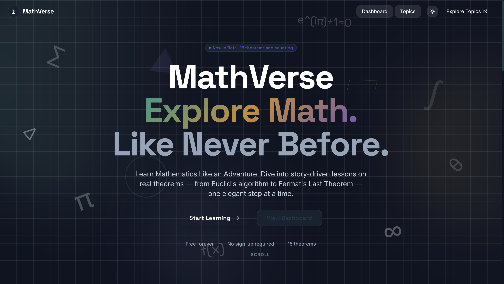

# MathVerse

MathVerse is an interactive math learning platform designed to make learning mathematics more engaging and easier to explore.

## Features

- Interactive theorem explanations
- Topic-based learning
- Quizzes with explanations
- Gamification with XP, coins and achievements
- Interactive and visual learning experience

## Screenshots

### Home

### Topics

## Tech Stack

- React
- TypeScript
- Vite
- Tailwind CSS
- Framer Motion
- Zustand

## Live Demo

[Visit MathVerse](https://math-verse-six.vercel.app)

## Project Structure

The main application is inside the `mathverse` folder.

## Status

Currently in development and continuously improving.
